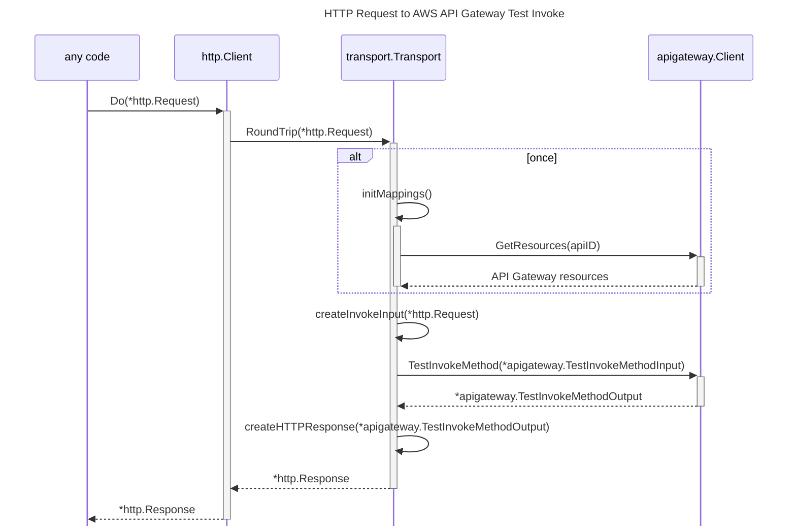

# aws-apigw-invoke-transport

An HTTP Transport that transform a Request to an API Gateway invoke.





## How to use
```go
package main

import (
	"context"
	"fmt"
	"net/http"
	"net/http/httputil"

	"github.com/aws/aws-sdk-go-v2/config"
	"github.com/aws/aws-sdk-go-v2/service/apigateway"
	"github.com/rcarrion2/aws-apigw-invoke-transport"
)

func main() {
	cfg, err := config.LoadDefaultConfig(context.Background(),
		config.WithSharedConfigProfile("your-profile"), // profile from credentials file
		config.WithRegion("us-east-1"),
	)

	if err != nil {
		panic(err)
	}

	// create an api gateway client
	cli := apigateway.NewFromConfig(cfg)

	// create the transport
	t := transport.NewTransport(cli, "your-api-id")

	// create the http client and pass the transport 
	httpCli := &http.Client{
		Transport: t,
	}

	// do the request
	httpResp, err := httpCli.Get("https://any.com/api/v1/users/new_user_1642793267?key=UserName-index")
	if err != nil {
		panic(err)
	}

	dump, _ := httputil.DumpResponse(httpResp, true)
	fmt.Println("response:", string(dump))
	
	// print mapped resources
	fmt.Println("mappings:", t.Mappings())
}

```