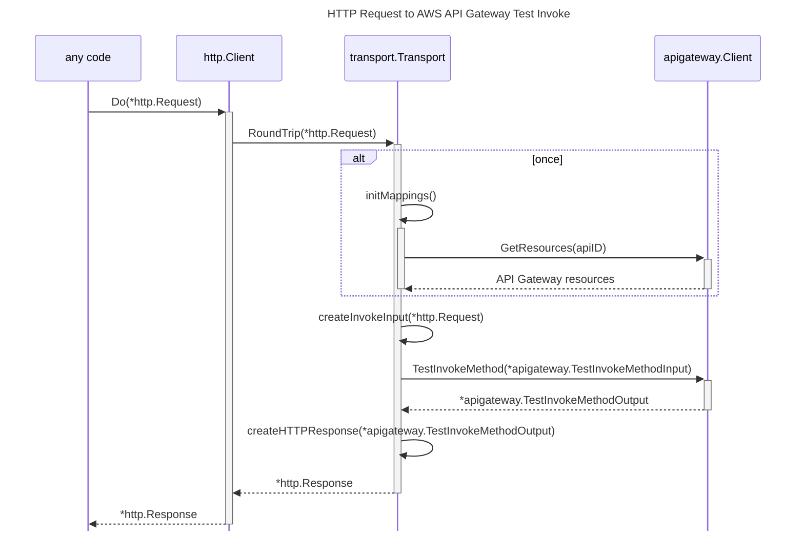

# aws-apigw-invoke-transport

An HTTP Transport that transform a Request to an api gateway invoke 

```mermaid
---
title: HTTP Request to AWS API Gateway Test Invoke
config:
    mirrorActors: false
---

sequenceDiagram
    participant code as any code
    participant http as http.Client
    participant transport as transport.Transport
    participant apigw as apigateway.Client
    code ->>+ http: Do(*http.Request)
    http ->>+ transport: RoundTrip(*http.Request)

    alt once
        transport ->>+ transport: initMappings()
        transport ->>+ apigw: GetResources(apiID)
        apigw -->>- transport: API Gateway resources
        deactivate transport
    end

    transport ->> transport: createInvokeInput(*http.Request)
    transport ->>+ apigw: TestInvokeMethod(*apigateway.TestInvokeMethodInput)
    apigw -->>- transport: *apigateway.TestInvokeMethodOutput
    transport ->> transport: createHTTPResponse(*apigateway.TestInvokeMethodOutput)
    transport -->>- http: *http.Response
    http -->>- code: *http.Response
```